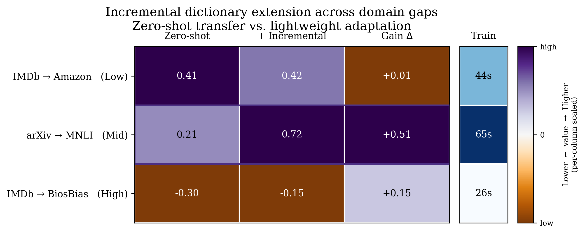

# Supplementary Update for Incremental Dictionary Extension

This page provides supplementary tables and figures referenced in the rebuttal for $\text{C}^2\text{U}$.

Unless otherwise noted, the default setting is **arXiv** with **$N=1024$, $K=30$, $\lambda=2.0$, and $n_{\text{profile}}=20$**.

**Metric conventions.** We use a consistent naming scheme across all tables:
- **Hit@K Drop ↑**: larger values indicate stronger target suppression.
- **Control Delta ↓**: smaller values indicate less non-target degradation.
- **Cos Drop ↑**: larger values indicate stronger target cosine suppression.
- **Exposure Delta ↓**: smaller values indicate lower non-target exposure.

**Incremental extension setup.** Freeze the original ACR backbone, append **64 new trainable atoms** to the dictionary (**6.2%** of the 1024-atom dictionary), and fine-tune only the query projection layer. This updates **0.7% of total parameters** (**172K / 23.3M**) and requires **no index rebuilding**.

## R1: Incremental Dictionary Extension

| Transfer Pair | Domain Gap | Zero-shot Hit@K Drop ↑ | + Incremental Hit@K Drop ↑ | Gain Δ | Train Time |
|---|---:|---:|---:|---:|---:|
| IMDb → Amazon | Low | 0.41 | 0.42 | +0.01 | 44s |
| arXiv → MNLI | Mid | 0.21 | 0.72 | +0.51 | 65s |
| IMDb → BiosBias | High | -0.30 | -0.15 | +0.15 | 26s |

**Figure R1.** Incremental dictionary extension across representative transfer pairs.

